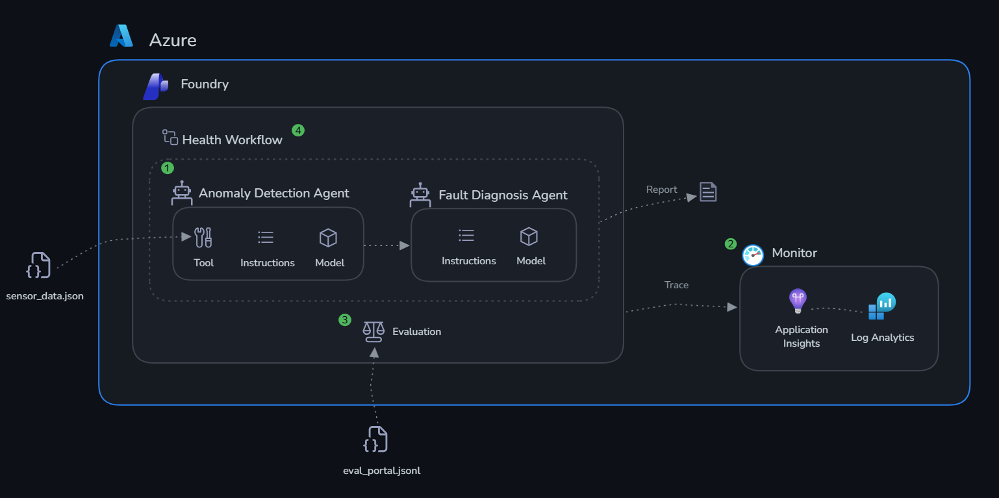
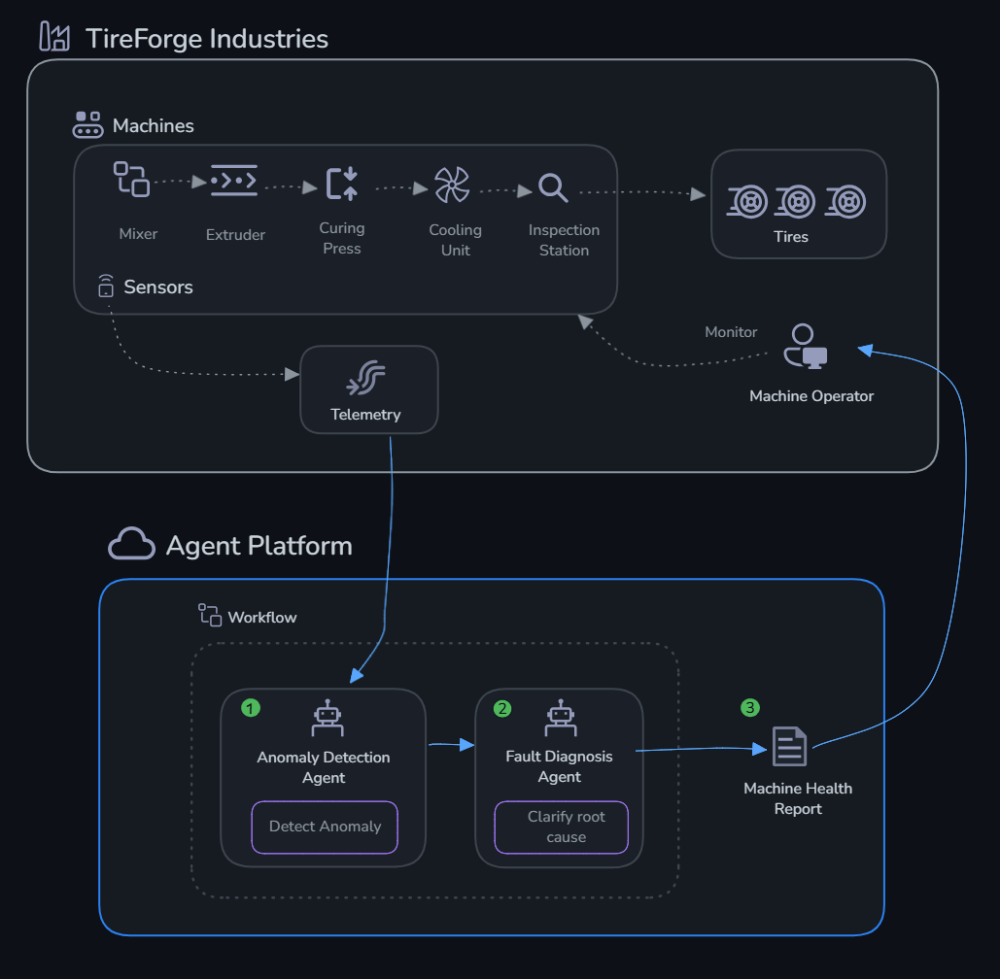

# 🏭 TireForge Predictive Maintenance — Multi-Agent AI System

A multi-agent AI system, built on **Microsoft Foundry (Azure AI Foundry Agent Service)**, that watches live sensor telemetry across a tire manufacturing plant, detects anomalies, diagnoses root causes, checks maintenance history and spare-part inventory, grounds its recommendations in the equipment manual, and — for critical faults — routes the decision through a human approval gate before opening a maintenance work order.

This started as the **Factory** scenario of Microsoft's *Foundry Agent-a-Thon* (FrontierWeekHack) hands-on lab and was extended well beyond the base exercises — see [What I Built](#what-i-built) below for what's original work versus lab scaffolding.


## The Scenario

**TireForge Industries** operates a tire manufacturing plant with 5 critical machines, each streaming temperature, pressure, vibration, and RPM readings in real time:

| Machine | Role |
|---|---|
| **MX-001** — Mixer | Blends raw rubber compounds |
| **EX-002** — Extruder | Shapes rubber into tire tread profiles |
| **CP-003** — Curing Press | Vulcanizes tires under heat and pressure |
| **CU-004** — Cooling Unit | Gradually cools cured tires |
| **IS-005** — Inspection Station | Quality assurance via vibration analysis |

The goal: catch a failing machine from its sensor signature *before* it causes a production-line stoppage or scraps a batch — and hand the maintenance team a decision they can trust, not a black-box guess.

## What I Built

The base lab asks you to build two agents that detect anomalies and diagnose faults. I implemented that core, plus several of the lab's own "Next Steps" suggestions, turning it into a closer-to-production system:

- **Anomaly Detection Agent** — calls a `check_thresholds` tool grounded in real per-machine spec data (not model guesswork) to flag out-of-spec sensor readings across all 5 machines.
- **Fault Diagnosis Agent** — given a set of anomalies, it:
  - Calls **`fetch_maintenance_history`** to pull a machine's past repair record from a mock CMMS before reasoning about root cause.
  - Uses **File Search (RAG)** against `TireForge_Manual_V2.md`, uploaded to a Foundry vector store, so recommendations cite documented procedures instead of general LLM knowledge.
  - Calls **`lookup_spare_parts`** against a mock inventory system to check part availability before recommending a fix, and suggests a workaround if the part is out of stock.
  - Classifies urgency (`IMMEDIATE` / `WITHIN 24H` / `MONITOR`) and flags whether the action `REQUIRES_APPROVAL`.
- **Human-in-the-loop approval gate** — when the diagnosis is `IMMEDIATE`, the pipeline stops and asks a human to approve before the `create_work_order` tool is allowed to open a ticket. Reject it, and it escalates to a shift supervisor instead of auto-executing.
- **Observability** — OpenTelemetry GenAI tracing exports every model call, tool call, and token count to Application Insights, so you can see exactly what data the model saw before it reached a conclusion.
- **Evaluation** — a 10-scenario LLM-as-judge dataset (coherence + fluency) for regression-testing prompt/model changes.
- **Multi-agent orchestration workflow** — both agents are wired into a `factory-health-workflow`, runnable either as Python code (step-by-step, with full function-call handling) or as a `WorkflowAgentDefinition` deployed to the Foundry portal and invoked asynchronously via the Responses API with background polling.

## Architecture





## Tech Stack

- **Microsoft Foundry / Azure AI Foundry Agent Service** — hosted, versioned agents (`azure-ai-projects`, `azure-ai-agents`)
- **Azure OpenAI** — reasoning model backing each agent
- **Function calling** — custom Python tools (`check_thresholds`, `fetch_maintenance_history`, `lookup_spare_parts`, `create_work_order`)
- **File Search / vector store** — retrieval-augmented generation over the equipment manual
- **OpenTelemetry + Azure Monitor** — distributed tracing (`azure-monitor-opentelemetry`)
- **Azure AI Evaluation SDK** — LLM-as-judge quality scoring
- **Azure CLI / Bash** — one-command infrastructure provisioning (`deploy.sh`) and teardown (`cleanup.sh`)

## Repository Structure

The folders are organized as build phases, each with its own detailed README:

| Folder | What's in it |
|---|---|
| [`challenge-0-setup/`](./challenge-0-setup/README.md) | `deploy.sh` — provisions the Foundry resource, project, model deployment, Log Analytics, and Application Insights via Azure CLI |
| [`challenge-1-build/`](./challenge-1-build/README.md) | `agents.py` — the Anomaly Detection + Fault Diagnosis agents, their tools, and the human-approval workflow; `sensor_data.json` — mock live telemetry |
| [`challenge-2-monitor/`](./challenge-2-monitor/README.md) | `monitor.py` — enables GenAI tracing and verifies traces land in Application Insights |
| [`challenge-3-evaluate/`](./challenge-3-evaluate/README.md) | `eval_portal.jsonl` — evaluation dataset for LLM-as-judge scoring in the Foundry portal |
| [`challenge-4-deploy/`](./challenge-4-deploy/README.md) | `deploy.py` — multi-agent orchestration (Python + portal `WorkflowAgentDefinition`); `evaluation_dataset.json` |
| `TireForge_Manual_V2.md` | Mock equipment manual used as the RAG knowledge base |
| `inventory.json`, `maintenance_history.json` | Mock spare-parts and CMMS data used by the tool functions |
| `cleanup.sh` | Tears down all Azure resources created by `deploy.sh` |

## Getting Started

```bash
git clone <this-repo-url>
cd azure-predictive-maintenance-agents
python3 -m venv .venv && source .venv/bin/activate
pip install -r requirements.txt
az login

# Provision Azure resources (writes .env to the repo root)
bash challenge-0-setup/deploy.sh

# Build & run both agents
cd challenge-1-build && python agents.py

# Enable tracing
cd ../challenge-2-monitor && python monitor.py

# Run the orchestrated multi-agent workflow
cd ../challenge-4-deploy && python deploy.py
```

Each folder's README walks through that step in detail, including what to expect in the Foundry portal. When you're done, tear everything down with `bash cleanup.sh` (reads the resource group from your `.env`).

## Roadmap

The base lab suggests several directions to extend the system further — here's what's done and what's still open:

- [x] Additional tools calling mock external systems (CMMS, inventory, ticketing)
- [x] Knowledge base / File Search grounding for the diagnosis agent
- [x] Human-in-the-loop approval for critical actions
- [x] Hosted, production-style workflow orchestration
- [ ] Parallelize anomaly checks across all 5 machines instead of sequential tool calls
- [ ] Confidence thresholds — escalate to a human when the Anomaly Agent is uncertain, not just when faults are critical
- [ ] CI/CD quality gate — run the evaluation dataset automatically on every prompt/model change
- [ ] Swap the mock JSON data sources (`sensor_data.json`, `inventory.json`, `maintenance_history.json`) for a live IoT Hub / real CMMS and ERP integration

## Acknowledgements

Built during Microsoft's **Foundry Agent-a-Thon** (FrontierWeekHack) hands-on lab — the Challenge 0–4 structure, base lab READMEs, mock sensor dataset, and Azure infrastructure scripts originate from [microsoft/FrontierWeekHack](https://github.com/microsoft/FrontierWeekHack) (MIT licensed). The agent tools beyond `check_thresholds` (maintenance history, spare parts, work orders), the RAG knowledge base integration, the human-in-the-loop approval flow, and the SDK bug fixes are my own extensions on top of that foundation.

## License

MIT — see [LICENSE](./LICENSE).
