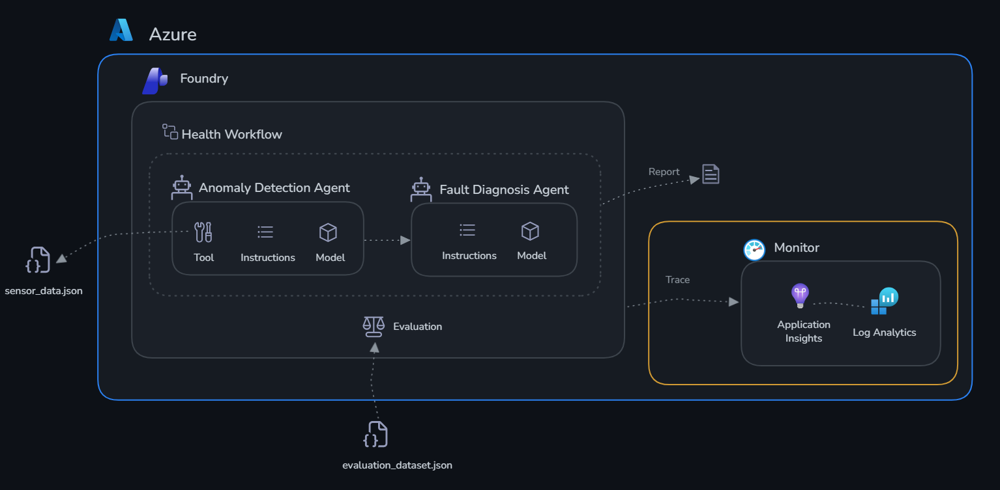
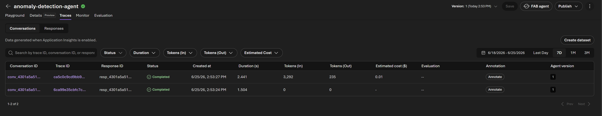
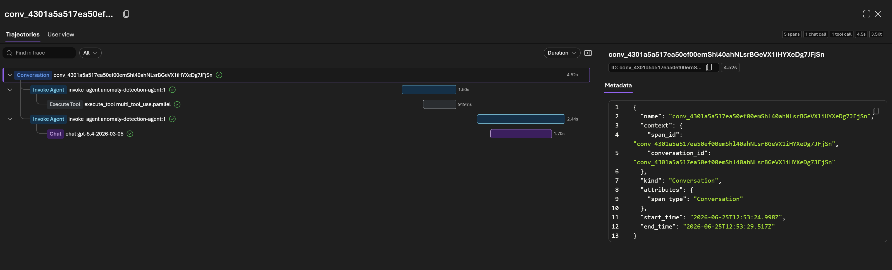
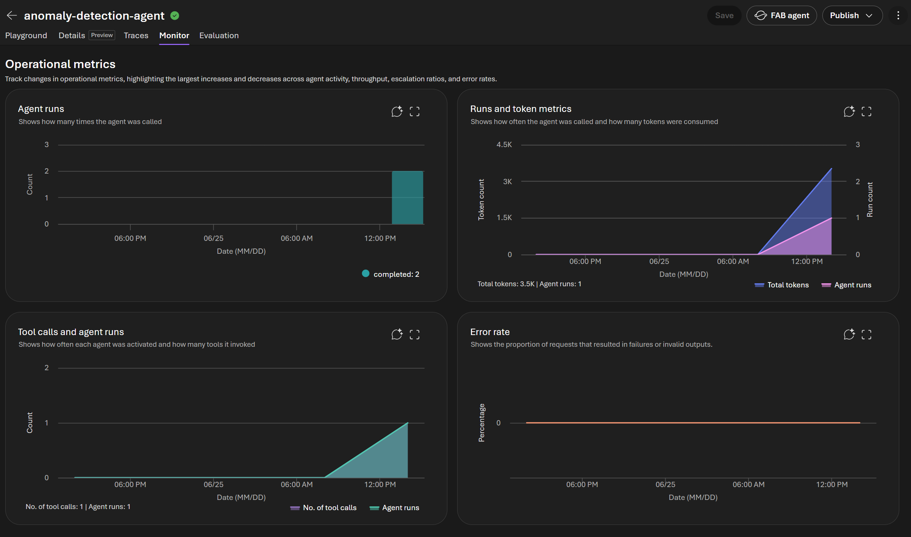
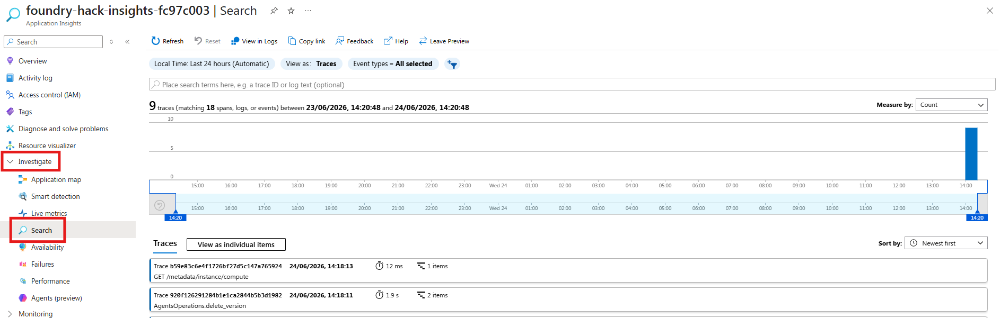
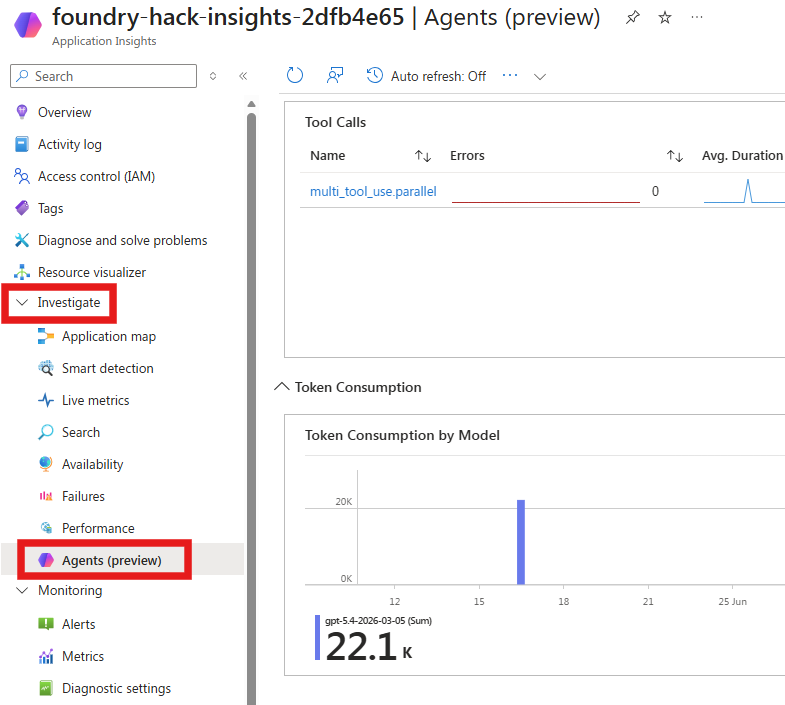

# Challenge 2: Monitor with Application Insights

Time: ~20 minutes

## Objectives

By the end of this challenge, you will have:

- ✅ GenAI tracing enabled for your Foundry agents
- ✅ Agent interactions visible as traces in Application Insights
- ✅ Understanding of how to debug agent behaviour in production



## Context

Your agents work — but how do you know they're working **well**? What if an agent gives a bad answer? What if latency spikes? What if a tool call fails silently?

**Application Insights** with **GenAI tracing** gives you:

- Full trace of every agent interaction (user message → model call → tool calls → response)
- Token usage per request
- Latency breakdown (network, model inference, tool execution)
- Error tracking and alerting

## Why Monitor?

AI agents behave differently from traditional software. A conventional API either returns the right data or throws an error — you can test it deterministically. An agent's output is probabilistic: the same input can produce subtly different responses on each run, tool calls can succeed but return unexpected data, and failures can be silent (the agent responds confidently but incorrectly). Without observability, these issues are invisible until a user reports them.

Monitoring serves three critical functions for AI agents:

- **Reliability** — Detect when agents stop working (tool call failures, timeouts, empty responses) before users do
- **Performance** — Track latency and token usage over time, catch regressions when you update a system prompt, and right-size your deployments for cost efficiency
- **Debugging** — When something goes wrong, distributed traces give you a complete record of what the model reasoned, what tools were called, what they returned, and exactly where the chain broke

For production AI systems, monitoring is the foundation that makes improvement possible. You can't fix what you can't see.

For TireForge specifically: a false negative from the Anomaly Detection Agent — reporting CP-003 as healthy when pressure is drifting toward failure — could mean a curing press breakdown mid-production run, scrapping an entire batch of tires. Traces show you exactly which sensor values the agent saw, what `check_thresholds` returned, and why the agent concluded "normal" — so you can fix the prompt or thresholds before it happens again.

## Portal or SDK?

Microsoft Foundry gives you two ways to monitor agents. The **Foundry portal** ([ai.azure.com/nextgen](https://ai.azure.com/nextgen)) has a built-in **Tracing** view where you can browse agent interactions, inspect individual spans, and see token usage and latency — no code required. **Application Insights** (via the Azure portal) gives you deeper analytics: Kusto queries, custom dashboards, and alerting rules.

In this challenge we use the **SDK** — `monitor.py` instruments your agents so every interaction is automatically captured as a distributed trace. Once the script runs, you'll explore those traces using both portal options, seeing how each one presents the same data differently.

## Prerequisites

Make sure your `.env` has:
```
AZURE_EXPERIMENTAL_ENABLE_GENAI_TRACING=true
OTEL_INSTRUMENTATION_GENAI_CAPTURE_MESSAGE_CONTENT=true
APPLICATIONINSIGHTS_CONNECTION_STRING=InstrumentationKey=xxx;...
```

## Connect Application Insights to the Portal

The deploy script automatically links Application Insights to your Foundry project. To confirm it worked, open the [Microsoft Foundry portal](https://ai.azure.com/nextgen), navigate to your project, and click **Tracing** in the left sidebar — you should see the Application Insights resource already connected.

If you see a **"Create or connect an App Insights resource to get started"** banner, the automatic connection was blocked by a tenant policy. Fix it in one click: click **Connect**, select the `foundry-hack-insights-<suffix>` resource from the dropdown, and confirm. You only need to do this once.

## Get Started

Open [monitor.py](./monitor.py) and review the tracing setup.

```bash
cd challenge-2-monitor
python monitor.py
```

Once the script finishes, your traces are live. Explore them in the Azure Portal.

---

### Step 1: Microsoft Foundry Portal

1. Go to [Microsoft Foundry Portal](https://ai.azure.com/nextgen) → open your project
2. Click on the `anomaly-detection-agent` -> **Traces** 

   - **Traces panel** — The **Conversations** tab lists every agent run as a row, showing the conversation ID, trace ID, response ID, status, creation time, duration, tokens in/out, estimated cost, evaluation results, and agent version. Use the search box and the **Status**, **Duration**, **Tokens**, and **Estimated Cost** filters (plus the date-range selector) to narrow results, switch to the **Responses** tab for individual model responses, or click **Create dataset** to turn these traces into an evaluation dataset.

   

3. You’ll see a list of recent traces — click any row to open it

   

4. Inside a trace you can see:
   - Each **agent turn** as a span (input → output)
   - **Tool calls** (`check_thresholds`, etc.) as child spans with inputs/outputs
   - **Token usage** and **latency** per span
   - The full model prompt and completion if `OTEL_INSTRUMENTATION_GENAI_CAPTURE_MESSAGE_CONTENT=true`
5. Use the **timeline view** to spot slow spans, and the **details panel** to inspect individual messages
6. Click on the `anomaly-detection-agent` -> **Monitor** 

   - **Monitor panel** — The **Overview** tab gives an at-a-glance health summary with cards for **Operational metrics** (estimated cost and total token usage), **Evaluations**, **Scheduled evaluations**, and **Scheduled red teaming run issues**. Below, the **Operational metrics** charts plot **Agent runs** (how often the agent was called) and **Runs and token metrics** (calls vs. tokens consumed) over the selected time range. Use the **Tools** tab, date filters, **Settings**, or **Open in Azure Monitor** for deeper analysis.

   

### Step 2 - Application Insights

1. Go to [portal.azure.com](https://portal.azure.com) → search for **Application Insights** → open `foundry-hack-insights-<suffix>`
2. Left sidebar → **Investigate** → **Search**



3. Set the time range to **Last 30 minutes** and click **Search** — you'll see individual trace events
4. Look for traces where your agents were invoked.
   You can inspect the timestamp, operation ID, and message payload to confirm calls reached the model.
5. Click on `Anomaly Detection Agent` instance.
You will see the **end-to-end transaction trace** showing:
   - The full agent conversation (user input with sensor anomalies → agent response with diagnosis)
   - Nested spans for each model call with latency breakdowns (e.g., `gpt-5.4-2026-03-05` taking 5.1 seconds)
   - The exact system prompt and generated reasoning the agent used to reach its conclusion
   - Resource details (AKS cluster, region) where the agent executed
   - Any content filtering blockers that violated default Responsible AI standards
   - This view lets you inspect exactly what the agent "saw" and "reasoned" to understand any misclassifications or performance issues
6. In the left sidebar → **Investigate** → **Agents (preview)** to open the agent-centric operations dashboard.

   - Use the **Time range** and **Agent** filters at the top to scope the view, switch between the **Dashboard** and **All agents** tabs, or click **Explore in Grafana** for deeper analysis.
   - **Agent Operational Metrics**:
     - **Agent Runs** — total invocations broken down per agent (e.g., `fault-diagnosis-agent`, `anomaly-detection-agent`). Click **View Traces with Agent Runs** to jump to the underlying traces.
     - **Gen AI Errors** — surfaces any traces with GenAI errors in the selected window; a green check means none were found.
     - **Tool Calls** — a table of each tool (e.g., `multi_tool_use.parallel`) with its error count, average duration, and number of calls, so you can spot slow or failing tools.
     - **Models** — per-model breakdown (e.g., `gpt-5.4-2026-03-05`, `gpt-5.4`) showing errors, average duration, and call counts.
   - **Token Consumption**:
     - **Token Consumption by Model** — total tokens consumed per model (e.g., ~22.1K for `gpt-5.4-2026-03-05`).
     - **Input vs Output Tokens** — input versus output token totals over time (e.g., 17K input vs 5.1K output), useful for tracking cost drivers.

---

## Success Criteria

- [ ] GenAI tracing is enabled and `monitor.py` ran successfully
- [ ] You can browse agent traces in the Foundry portal **Traces** view and open a conversation
- [ ] You can read the **Monitor** panel (agent runs, token usage, estimated cost)
- [ ] You can see at least one agent trace in Application Insights and open its end-to-end transaction trace
- [ ] You can use the **Agents (preview)** dashboard to view agent runs, tool calls, models, and token consumption
- [ ] You understand where to look when an agent misbehaves
