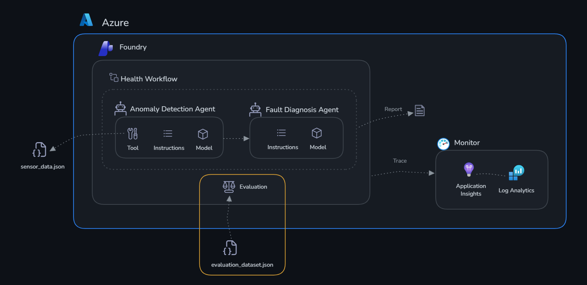

# Phase 3 — Evaluate

**Estimated time to reproduce:** ~30 minutes

## Objectives

By the end of this phase you'll have:

- ✅ Run a systematic evaluation of your agents against a test dataset
- ✅ Used built-in evaluators (coherence, fluency) to measure quality
- ✅ Interpreted evaluation metrics and identified areas for improvement
- ✅ Understanding of how to integrate evaluations into a CI/CD pipeline

## Context

Monitoring tells you **what's happening** (latency, errors, token usage). Evaluation tells you **if the answers are actually good**.

You have a dataset of 10 test cases — each with a sensor reading snapshot and the expected correct output (classification + recommended action). You'll run your agents against these test cases and measure how well they perform using LLM-as-judge scoring.

## Why Evaluate?

Monitoring tells you your agents are *running* — evaluation tells you they're doing the *right thing*. These are fundamentally different questions.

Monitoring captures **operational signals**: latency, token count, error rates, uptime. These tell you *how* the system behaves mechanically. Evaluation captures **quality signals**: are the agent's outputs correct, relevant, coherent, and consistent with expected outcomes? These tell you *whether* the system is actually doing its job.

Without systematic evaluation, you're relying on spot-checks — reading a handful of responses and judging them subjectively. This doesn't scale, isn't repeatable, and can't catch regressions when you update a prompt or switch models. Evaluation gives you a measurable baseline: a score you can track over time and compare across versions.

Evaluation also surfaces issues that monitoring is blind to. An agent that always responds quickly and without errors but consistently misdiagnoses fault conditions — or recommends "schedule routine maintenance" for a machine that needs immediate shutdown — looks perfectly healthy to monitoring. Evaluation catches it immediately.

For production AI, evaluations should run:

- **Before deployment** — establish a quality baseline and gate releases on minimum scores
- **After any change** — to system prompts, models, tools, or threshold data
- **On a schedule** — to detect drift as machine configurations or operating conditions evolve

For TireForge specifically: an agent that confidently diagnoses a CP-003 anomaly as "normal vibration" when thresholds are actually exceeded could delay a critical maintenance action by hours. Monitoring sees a clean, fast response. Only evaluation — comparing the output against the known correct classification — reveals the miss.

## The Evaluation Dataset

The dataset lives at [challenge-4-deploy/evaluation_dataset.json](../challenge-4-deploy/evaluation_dataset.json) — it contains:

- 10 scenarios covering normal, warning, and critical machines
- Each has an `input` (what you send to the agent)
- Each has an `expected_output` (the correct classification and action)

## About the Evaluators

Microsoft Foundry uses an **LLM-as-judge** approach — a separate model reads each agent response alongside the input and ground truth, then scores it on a 1–5 scale. You'll use two built-in evaluators:

- **Coherence** — measures whether the agent's response is logically structured and internally consistent. A score of 5 means the output is clear, well-organised, and flows naturally. A low score means the response is contradictory, jumbled, or hard to follow. For a factory agent this catches things like recommending "no action" while simultaneously listing critical anomalies.

- **Fluency** — measures the grammatical and linguistic quality of the agent's response. A score of 5 means the output is well-written, natural, and easy to read. A low score means the response is awkwardly phrased, grammatically broken, or hard to parse — which undermines trust in the classification even when the underlying diagnosis is correct.

These two scores together give you a quick signal on output quality. When you see a low coherence score, look at the agent's system prompt structure. When you see a low fluency score, look at how the agent phrases its output and whether its system prompt encourages clear, well-formed responses.

## Get Started

The evaluation dataset has already been prepared for you as [eval_portal.jsonl](./eval_portal.jsonl) — 10 machine sensor scenarios ready to upload.

---

### Step 1: Open the Evaluation tab

1. Go to the [Microsoft Foundry portal](https://ai.azure.com/nextgen) → your project
2. On the top bar → **Build** → **Evaluations** → **Create**

### Step 2: Configure the evaluation

3. Select **Agent** as the evaluation target
4. Choose `anomaly-detection-agent` from the dropdown
5. Select **Individual Turns** and then **Existing Dataset**
6. Click on **Upload new dataset**. 
You must enter a dataset name first — the upload stays disabled until you do. Type a name (e.g. `factory-eval`), then add the file located at `challenge-3-evaluate/eval_portal.jsonl` and confirm the upload.
7. Leave the **Field Mapping** and **Configure Agents** fields as is.
8. In the **Criteria** step, keep only **Coherence** and **Fluency**. Remove every other evaluator — in particular **deselect Tool Call Accuracy**, since the agents can't execute the local tools during evaluation and will always score low on it. Trimming the evaluator list also makes the run significantly faster.
9. Leave the Evaluation Name as is or configure to your liking.
10. Submit your Evaluation. This will take some time to run.

### Step 3: View results

Results appear in the **Evaluate** tab within a few minutes. Click the run name to open the results.

There are two ways to read the results, and they answer different questions:

- **Aggregate metrics** — the average score for each evaluator across all 10 test cases (e.g. an overall Coherence of 4.2). This is your single-number quality baseline — the headline figure you track over time and compare across agent versions.
- **Per-row analysis** — the score for each individual test case, so you can see *which specific scenarios* dragged the average down. The aggregate tells you *if* there's a problem; the per-row view tells you *where* it is. Sort by the lowest scores to find the cases worth investigating.

---

## Verification Checklist

- [ ] Evaluation runs against all 10 test cases without errors
- [ ] You can see per-row scores for coherence and fluency
- [ ] You've identified at least one case where the agent could improve
- [ ] You understand the difference between aggregate metrics and per-row analysis
