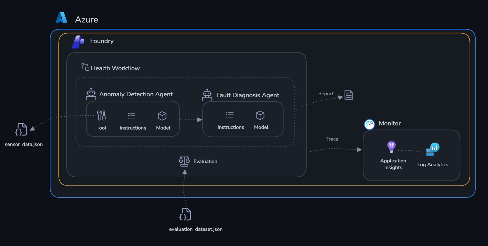
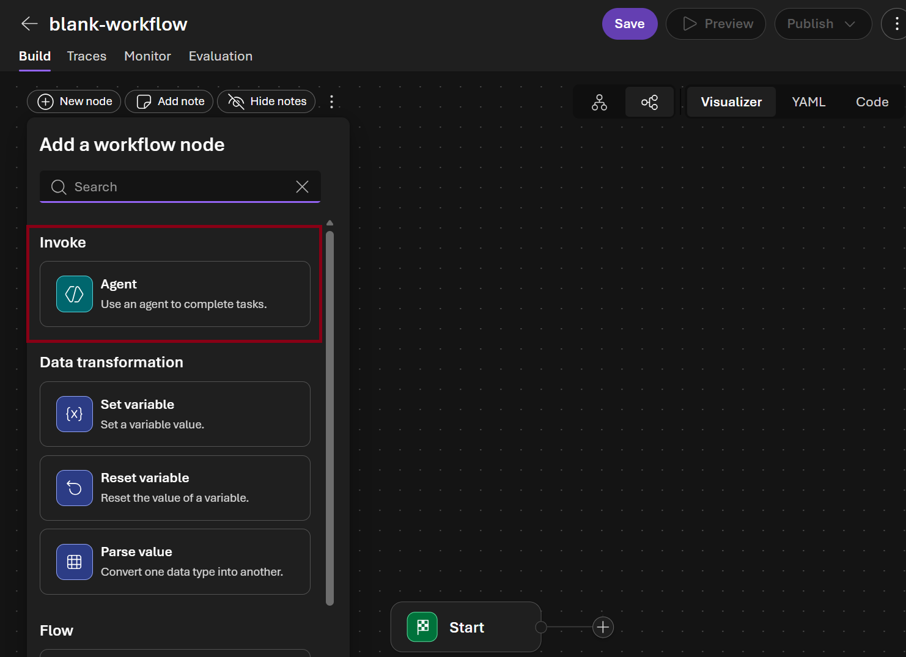
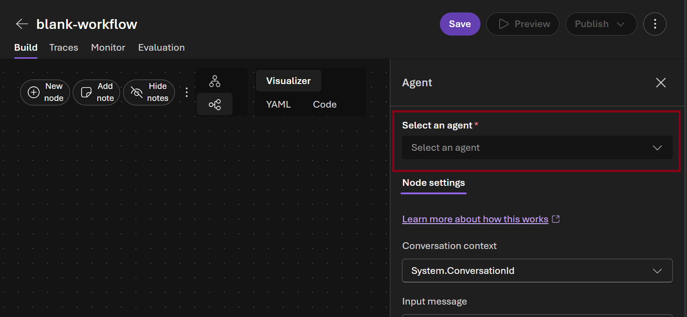
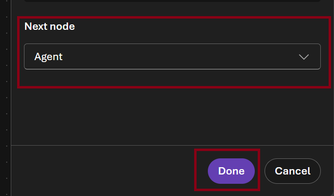
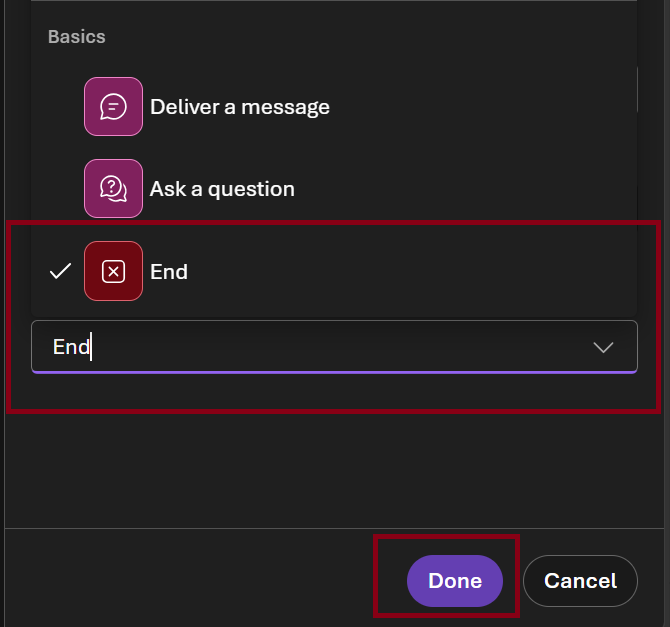
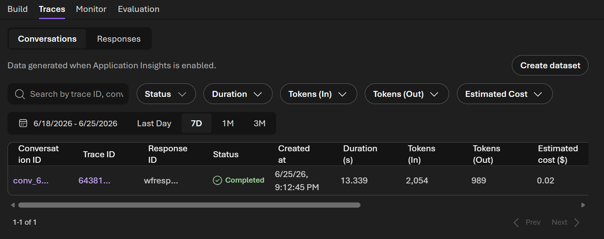

# Challenge 4: Production Workflow

Time: ~20 minutes

Build a multi-agent orchestration workflow for TireForge Industries and take it to production.

## Scenario

The individual agents you built in Challenge 1 are valuable — but in production, agents need to work
**together** as an automated pipeline. In this challenge you wire the two agents into a full
factory health workflow, run it from code, then build and test it visually in the Foundry portal.



## Learning Objectives

- Deploy persistent production agents (create once, reuse forever)
- Orchestrate multiple agents step-by-step in a Python workflow
- Build the same workflow visually in the Foundry portal
- Invoke the portal workflow from Python with live streaming
- View run history and traces in the portal

## The Workflow

```
ensure_agents_deployed()
        |
        v
run_anomaly_scan()          <-- Anomaly Detection Agent checks all 5 machines
        |
        v (for each machine with anomalies)
run_fault_diagnosis()       <-- Fault Diagnosis Agent diagnoses root cause
        |
        v
print_factory_report()      <-- Consolidated Health Report
```

---

## Part 1 — SDK: Build and Run the Python Workflow

### Step 1: Review the implementation

Open [deploy.py](./deploy.py) and review:

- **`ensure_agents_deployed()`** — lists existing agents, creates `anomaly-detection-agent` and `fault-diagnosis-agent` if not present
- **`run_anomaly_scan()`** — calls the anomaly agent, handles the `check_thresholds` function call loop
- **`run_fault_diagnosis()`** — calls the diagnosis agent for each affected machine
- **`run_factory_health_workflow()`** — orchestrates all steps and returns the consolidated report

### Step 2: Run the workflow

```bash
cd challenge-4-deploy
python deploy.py
```

Expected output:
```
=== Step 1: Ensure Agents Are Deployed ===
  Found existing: anomaly-detection-agent
  Found existing: fault-diagnosis-agent

=== Step 2a: Anomaly Scan ===
  CP-003 CRITICAL: vibration 143% above max, pressure 13.8% above max, temperature 10.3% above max
  MX-001 WARNING: vibration 6.7% above max, temperature 2.6% above max
  IS-005 WARNING: vibration 30% above max
  ...

=== Step 2b: Fault Diagnosis ===
  Diagnosing CP-003...
  Diagnosing MX-001...
  Diagnosing IS-005...

TIREFORGE FACTORY HEALTH REPORT
  Machines checked   : 5
  Machines affected  : 2
  ...
```

---

## Part 2 — Portal: Build and Test the Visual Workflow

### Step 3: Verify agents are deployed in the portal

1. Open the [Microsoft Foundry portal](https://ai.azure.com/nextgen)
2. Select your project
3. Select **Build** → **Agents** in the top bar
4. Confirm both agents appear:
   - `anomaly-detection-agent`
   - `fault-diagnosis-agent`


### Step 4: Build the workflow in the portal designer

1. Select **Build** → **Agents** → **Workflows**
2. Notice that the workflow created using the SDK in Part 1 is listed. Let's create a new workflow by selecting **Create** → **Blank workflow**


3. In the visual designer **Add a workflow node** dialog choose **Agent**

   

4. In the **Select an agent** picker select `anomaly-detection-agent`

   

5. In the **Next node** picker select **Agent** and click **Done** button
   \
    

6. Select the new agent node in the canvas and in the **Select and agent** picker select `fault-diagnosis-agent`

    

7. In the **Next node** picker select **End** and click **Done** button

     

8. Select **Save** and name it `factory-health-workflow-portal`

 

### Step 5: Test the workflow in the portal playground

> **Why you must include the sensor data in your message**
>
> The agents use a `check_thresholds` tool that reads from a local Python file.
> The portal playground **cannot execute Python functions** — if you send a generic
> prompt, the agent will try to call the tool and stall waiting for a result that
> never arrives. Paste the sensor readings directly into your message so the agents
> can work without needing the tool.

1. In the **factory-health-workflow-portal** workflow canvas select **Preview**

 

2. Paste the following message (data is pre-embedded so no tool calls are needed):

   ```
   All sensor readings for today are below — analyse them directly, do not call check_thresholds.

   MX-001 (mixer) — status: warning
     temperature: 92.3°C  [normal 60–90]  ⚠️ ABOVE MAX
     pressure:     3.1 bar [normal 2.0–4.0]
     vibration:    4.8 mm/s [normal 0–4.5]  ⚠️ ABOVE MAX
     rpm:          58 rpm  [normal 40–65]

   EX-002 (extruder) — status: normal
     temperature: 115.0°C [normal 100–130]
     pressure:    12.5 bar [normal 10.0–15.0]
     vibration:    2.1 mm/s [normal 0–3.5]
     rpm:          30 rpm  [normal 20–40]

   CP-003 (curing_press) — status: critical
     temperature: 198.5°C [normal 140–180]  🔴 ABOVE MAX
     pressure:    18.2 bar [normal 12.0–16.0]  🔴 ABOVE MAX
     vibration:    7.3 mm/s [normal 0–3.0]  🔴 ABOVE MAX
     rpm:           0 rpm  [normal 0]

   CU-004 (cooling_unit) — status: normal
     temperature: 35.2°C  [normal 20–45]
     pressure:     1.0 bar [normal 0.8–1.5]
     vibration:    0.8 mm/s [normal 0–2.0]
     rpm:         120 rpm  [normal 80–150]

   IS-005 (inspection_station) — status: warning
     temperature: 28.0°C  [normal 18–30]
     pressure:     1.0 bar [normal 0.8–1.2]
     vibration:    5.2 mm/s [normal 0–4.0]  ⚠️ ABOVE MAX
     rpm:        1800 rpm  [normal 1500–2200]

   Detect all anomalies, then diagnose root causes and recommend remediation for affected machines.
   ```

3. Watch the steps execute in sequence — anomaly scan first, then fault diagnosis
4. Review the final consolidated report


### Step 6: View run history and traces

1. In the **factory-health-workflow-portal** workflow click **Traces** 

 

2. Click the latest run to see the execution timeline — each step, duration, and output


---

## Success Criteria

- [ ] Python workflow runs end-to-end: anomaly scan → diagnosis → factory health report
- [ ] Both agents visible in the Foundry portal as persistent assets
- [ ] Visual workflow created in the portal and tested in its playground

---

## Beyond the Lab: Production Deployment Options

You've built and tested your agents locally. Here's how to take them to production:

### Option 1: Hosted Agents (What You Already Have)

Your agents created with `agents.create_version()` are already production-ready hosted agents. They live in Foundry indefinitely — any client can invoke them by name via the Responses API. No infrastructure to manage; Foundry handles scaling, versioning, and availability.

- **Versioning**: Each `create_version()` produces an immutable version. Roll back by referencing an older version.
- **Multi-tenant**: Multiple users/apps can call the same agent simultaneously.
- **Portal visibility**: Agents appear under Build → Agents with playground, run history, and tracing.

### Option 2: Foundry Workflows (Visual Orchestration)

What you built in Part 2 — wire multiple hosted agents into a DAG using the portal designer. The workflow becomes a deployable agent invoked via the same Responses API.

- Step sequencing with automatic output passing
- Streaming `workflow_action` events showing progress
- Run history with per-step timing

### Option 3: Azure App Service / Container Apps

Wrap your Python workflow in a FastAPI/Flask app for custom middleware, auth, or business logic:

```python
# Example: FastAPI endpoint that calls your Foundry agents
@app.post("/factory-health-check")
async def health_check():
    report = run_factory_health_workflow(anomaly_agent, diagnosis_agent)
    return report
```

Deploy to **App Service** (managed PaaS) or **Container Apps** (auto-scaling containers).

### Option 4: Azure Functions (Event-Driven)

Trigger agent workflows from events:

- **Timer trigger**: Run the factory health check every hour
- **Service Bus trigger**: Process each anomaly alert as it arrives from IoT Hub
- **HTTP trigger**: On-demand endpoint for maintenance teams

Pay-per-execution, scales to zero when idle.

### Option 5: CI/CD Quality Gates

Integrate evaluation into your deployment pipeline:

- Run `evaluate.py` on every PR — block merge if quality drops below threshold
- Promote agent versions: `v1-dev` → `v1-staging` → `v1-prod` after evaluation passes
- Blue/green: Deploy new version to 10% traffic, compare metrics, then promote

### Summary

| Pattern | Best For |
|---------|----------|
| Hosted Agents | Always-on, invoke by name, no infra management |
| Foundry Workflows | Multi-agent orchestration without code |
| App Service / Containers | Custom auth, middleware, webhooks |
| Azure Functions | Event-driven, pay-per-use, IoT integration |
| CI/CD Gates | Automated quality assurance before promotion |
